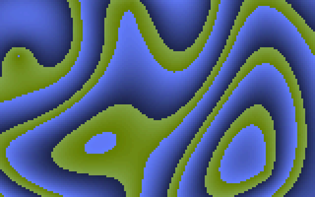

# DOSFX

Some effects written in Turbo-C 2.01 for MSDOS 

## PLASMA

The plasma effect is an iconic visual effect from the 90s demoscene, especially popular in demos on the Amiga and MS-DOS. This effect consists of a colorful, fluid distortion, animated to create the impression of moving waves or merging bubbles undulating across the screen. It is based on real-time distortion calculations, where colors are interpolated to create a psychedelic and hypnotic gradient.

In demoscene culture, the plasma effect left a lasting impression, symbolizing innovation and creativity under strict technical constraints, while offering a distinctive and mesmerizing aesthetic unique to that era.

