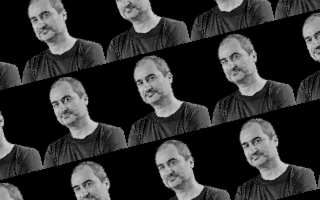

# DOSFX

Some effects written in Turbo-C 2.01 for MSDOS 

## PLASMA

The plasma effect is an iconic visual effect from the 90s demoscene, especially popular in demos on the Amiga and MS-DOS. This effect consists of a colorful, fluid distortion, animated to create the impression of moving waves or merging bubbles undulating across the screen. It is based on real-time distortion calculations, where colors are interpolated to create a psychedelic and hypnotic gradient.

In demoscene culture, the plasma effect left a lasting impression, symbolizing innovation and creativity under strict technical constraints, while offering a distinctive and mesmerizing aesthetic unique to that era.

## ROTOZOOM

The rotozoomer effect is a classic visual technique from the 90s demoscene, frequently showcased in Amiga, Atari ST, and MS-DOS demos. This effect combines rotation and zooming to create an animated, continuously transforming image, typically of a texture, pattern, or scene. As the image rotates and zooms simultaneously, it produces a dynamic, hypnotic movement that often feels like a tunnel or vortex effect.

In the demoscene, the rotozoom effect became iconic for its mesmerizing appearance and its ability to demonstrate the skill of developers in optimizing code to handle intensive calculations on limited hardware. This effect remains a symbol of the ingenuity and technical artistry that defined the 90s demoscene.

