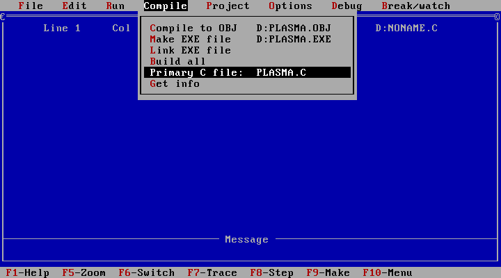

# DOSFX

Some effects written in Turbo-C 2.01 for MSDOS.

## EFFECTS

Here is the list of the implemented effects.

### PLASMA

The plasma effect is an iconic visual effect from the 90s demoscene, especially popular in demos on the Amiga and MS-DOS. This effect consists of a colorful, fluid distortion, animated to create the impression of moving waves or merging bubbles undulating across the screen. It is based on real-time distortion calculations, where colors are interpolated to create a psychedelic and hypnotic gradient.


In demoscene culture, the plasma effect left a lasting impression, symbolizing innovation and creativity under strict technical constraints, while offering a distinctive and mesmerizing aesthetic unique to that era.

### ROTOZOOM

The rotozoomer effect is a classic visual technique from the 90s demoscene, frequently showcased in Amiga, Atari ST, and MS-DOS demos. This effect combines rotation and zooming to create an animated, continuously transforming image, typically of a texture, pattern, or scene. As the image rotates and zooms simultaneously, it produces a dynamic, hypnotic movement that often feels like a tunnel or vortex effect.


In the demoscene, the rotozoom effect became iconic for its mesmerizing appearance and its ability to demonstrate the skill of developers in optimizing code to handle intensive calculations on limited hardware. This effect remains a symbol of the ingenuity and technical artistry that defined the 90s demoscene.

### SCALER

The fullscreen scaler effect is a well-known visual technique from the 90s demoscene, where an image, object, or sprite is dynamically resized to fill the screen. This effect often showcases smooth scaling, either zooming an object in and out or moving it across the screen at various sizes, creating a dramatic and eye-catching transition.


In the demoscene, the fullscreen scaler became a hallmark of coding skill, as it demonstrated both an understanding of graphics processing and a talent for creating visually impressive results on limited hardware. This effect played a significant role in establishing the fast-paced, visually intense style characteristic of 90s demos.

### TUNNEL

The tunnel effect is a classic visual technique from the 90s demoscene, where a graphic simulates a 3D tunnel that appears to endlessly zoom toward or away from the viewer, creating a captivating sense of depth and motion. This effect gives the illusion of traveling through a cylindrical or vortex-like space, often lined with textures or patterns that seem to flow around the edges of the screen, enhancing the immersive feel.


In the demoscene, the tunnel effect became iconic as a display of both technical skill and visual artistry, capturing viewers' attention with its immersive 3D appearance. This effect played a significant role in defining the fast-paced, surreal aesthetics that characterized many demos of the era.

### WOBBLE

The wobble effect is a distinctive visual technique from the 90s demoscene, where an image, texture, or object appears to ripple or oscillate as if moving through waves or under water. This effect creates a fluid, dynamic look, making the graphic appear as if it’s bending, stretching, or vibrating in sync with a sine wave pattern.


In the demoscene, the wobble effect became iconic for its captivating, hypnotic movement and for showcasing a coder’s skill in manipulating graphics at the pixel level. This effect contributed to the surreal, otherworldly aesthetic of 90s demos and remains a memorable example of creative programming on early computers.

## CONFIGURE, BUILD AND RUN

### Launch Turbo C


### Set primary C file




### Set large memory model


### Set code generation


### Set optimize for speed


### Set register optimization


### Set jump optimization


### Unset graphics library


### Save options


### Build all


### Run


## LICENSE

This project is released under the terms of the General Public License version 2.

```
dosfx - Copyright (c) 2024 - Olivier Poncet

This program is free software: you can redistribute it and/or modify
it under the terms of the GNU General Public License as published by
the Free Software Foundation, either version 2 of the License, or
(at your option) any later version.

This program is distributed in the hope that it will be useful,
but WITHOUT ANY WARRANTY; without even the implied warranty of
MERCHANTABILITY or FITNESS FOR A PARTICULAR PURPOSE.  See the
GNU General Public License for more details.

You should have received a copy of the GNU General Public License
along with this program.  If not, see <http://www.gnu.org/licenses/>.
```
